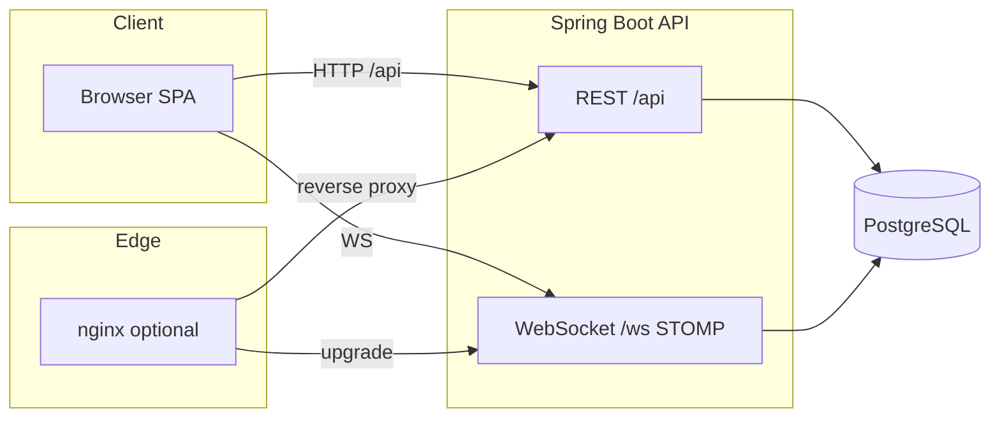

# EduCycle — Kiến trúc & Onboarding

Tài liệu này bổ sung [`README.md`](README.md) (cách chạy, tính năng) và [`NOTES.md`](NOTES.md) (trạng thái, backlog, quy tắc nội bộ).  
Mục tiêu: **hiểu hệ thống trong 10 phút** và **onboarding người mới / chính bạn sau vài tháng**.

---

## 1. Bản đồ tài liệu

| File | Nội dung |
|------|----------|
| `README.md` | Giới thiệu, clone, chạy BE/FE/Docker, SMTP, API tóm tắt |
| `NOTES.md` | Sprint, changelog, open tasks, FE↔BE field mapping, UI rules |
| `ARCHITECTURE.md` | **(file này)** — sơ đồ runtime, luồng auth/WS, gói code, pitfall |
| `SETUP_CHATBOT.md` | Biến môi trường AI, Docker, rate limit |
| `.env.example` (gốc repo) | JWT, frontend URL, Anthropic, gợi ý SMTP |

---

## 2. Tổng quan hệ thống

### 2.1 Ngữ cảnh (logical)



- **SPA** gọi REST + (tuỳ trang) WebSocket.
- **Dev:** Vite proxy `/api` + `/ws` → một origin backend (cổng 8080 hoặc 8081).
- **Docker full stack:** nginx (cổng 80) phục vụ static FE + proxy `/api`, `/ws` → container `api`.

### 2.2 Hai “topology” chạy thường gặp

| Topology | Mục đích | Postgres trên host | API trên host | FE |
|----------|----------|---------------------|---------------|-----|
| **A — Dev hybrid** | Sửa code nhanh | Có: `educycle-java/docker-compose` → **localhost:5433** | `mvn` profile **docker** → **8081** | `npm run dev` → **5173**, proxy → **8081** |
| **B — Full Docker** | Demo / gần prod | **Không** (chỉ mạng `db`) | **Không** (chỉ trong compose) | **http://localhost** (nginx) |

**Quan trọng:** `docker-compose.yml` **gốc repo** **không publish** cổng `db` và `api` ra máy host. Vì vậy:

- **pgAdmin** trỏ `localhost:5433` chỉ hoạt động khi bạn chạy **`source/backend/educycle-java/docker-compose.yml`** (hoặc tự thêm `ports`).
- **`npm run dev` + chỉ chạy compose gốc** → proxy Vite **không** có API trên `localhost:8080` — cần thêm `mvn` local **hoặc** publish cổng `api`.

---

## 3. Backend (`source/backend/educycle-java`)

### 3.1 Lớp & gói (chuẩn chỉnh hóa)

```
com.educycle
├── controller/     # REST, map path /api/...
├── service/        # Interface + impl (nghiệp vụ, @Transactional)
├── repository/     # Spring Data JPA
├── model/          # Entity JPA
├── dto/            # Record request/response
├── config/         # Security, CORS, WebSocket, properties
├── security/       # JWT filter, UserDetails, token provider
├── exception/      # AppException + GlobalExceptionHandler
└── resources/db/migration/  # Flyway V1… — file mới tiếp theo V9
```

- **Validation:** Jakarta Validation trên DTO/controller.
- **Lỗi API:** `GlobalExceptionHandler` → JSON `{ success, message, errors? }`.
- **Role:** `ADMIN` / `USER` trong JWT claim `role`; method security `@PreAuthorize("hasRole('ADMIN')")` nơi cần.

### 3.2 Xác thực (JWT + OAuth)

1. **Email/mật khẩu:** `POST /api/auth/login` → JWT access + refresh (refresh lưu DB, rotate).
2. **Mỗi request (trừ permitAll):** header `Authorization: Bearer <access>`.
3. **Filter:** `JwtAuthenticationFilter` đọc JWT, set `SecurityContext` (principal = `userId` string).
4. **Google / Microsoft:** FE lấy token → `POST /api/auth/social-login` → BE verify JWKS / tokeninfo → cấp JWT nội bộ.

### 3.3 WebSocket (chat giao dịch)

- Endpoint SockJS/STOMP: **`/ws`** (qua proxy cùng origin với API trong dev/docker).
- JWT thường gửi khi handshake/subscribe (xem `WebSocketConfig` + client `websocket.js`).
- Tin nhắn lưu DB; STOMP broadcast tới subscribers.

### 3.4 Upload ảnh sản phẩm

- **POST** upload → lưu file dưới `app.upload-dir` (local path; Docker volume `/app/data/uploads`).
- **GET** `/api/files/{uuid}.ext` phục vụ file (public read theo `SecurityConfig`).
- **Production sau này:** object storage + URL công khai (thay path local).

### 3.5 Flyway

- **Không sửa** file migration đã apply trên DB.
- Phiên bản hiện tại trong repo: **V1–V8**; migration tiếp theo đặt tên **`V9__....sql`**.

### 3.6 SMTP (tuỳ chọn)

- Profile Spring **`smtp`** + `application-smtp.yml` + biến `MAIL_*` (xem `README.md`).
- Không bật profile → `MailService` **log** nội dung mail (đủ cho dev).

### 3.7 AI chat

- Endpoint chat qua BE (key server-side trong Docker / env).
- Rate limit in-memory: **`AiChatRateLimiter`** (scale sau: Redis). Chi tiết: [`SETUP_CHATBOT.md`](SETUP_CHATBOT.md).

---

## 4. Frontend (`source/frontend`)

### 4.1 Định tuyến

- Định nghĩa trong [`src/App.jsx`](source/frontend/src/App.jsx): `Layout` + `lazy` pages + `ProtectedRoute` / `GuestRoute` / `adminOnly`.
- **`/products`** (list URL cũ) redirect về **`/`** và scroll `#products` — PLP chi tiết có thể tách route sau nếu cần SEO/share link.

### 4.2 Gọi API

- **`src/api/axios.js`:** instance Axios, base URL từ `resolveApiBaseUrl()` (`VITE_API_URL` hoặc mặc định **`/api`**).
- **Dev:** `/api` → Vite proxy → backend (mặc định **8080**; profile docker BE → đặt `VITE_DEV_PROXY_TARGET=http://localhost:8081` trong `.env.local` hoặc `.env.development`).
- **Lỗi:** `getApiErrorMessage` / `userFacingMessage` trên interceptor ([`apiError.js`](source/frontend/src/utils/apiError.js)).

### 4.3 State

- **Auth:** `AuthContext` + `localStorage` qua `safeSession` (token, refreshToken, user).
- **Notifications:** context + STOMP/poll tùy cấu hình trang.

### 4.4 Chuẩn nghiệp vụ FE

- So sánh **status / role** từ BE: luôn **`.toUpperCase()`** trước khi so chuỗi.
- CSS: token từ [`tokens.css`](source/frontend/src/styles/tokens.css) (không hardcode hex/pixel tùy tiện).

---

## 5. Luồng dữ liệu ví dụ (để phỏng vấn / debug)

### 5.1 Đăng nhập → gọi API có bảo vệ

```text
User submit login → POST /api/auth/login
→ FE lưu token + refreshToken + user
→ Axios interceptor gắn Authorization
→ GET /api/transactions/mine → 200 nếu token hợp lệ
```

### 5.2 Vào chi tiết giao dịch + chat

```text
GET /api/transactions/{id} (hoặc tương đương trong endpoints)
→ Mở WebSocket STOMP /ws + subscribe phòng chat
→ Gửi tin: STOMP nếu connected, fallback POST messages API
```

---

## 6. CI & chất lượng

- [`.github/workflows/ci.yml`](.github/workflows/ci.yml): `mvn … clean verify` (BE) + `npm ci` / `npm test` / `npm run build` (FE).
- Trước khi push: `mvn clean compile -q` (BE), `npm run build` (FE) — khớp [`NOTES.md`](NOTES.md) / `.cursor/rules/educycle.mdc`.

---

## 7. Onboarding — checklist

### 7.1 Người mới clone repo (dev hàng ngày — Topology A)

1. Cài: **JDK 17**, **Node 18+**, **Docker Desktop**, **Maven**.
2. Postgres dev:
   ```bash
   cd source/backend/educycle-java && docker compose up -d
   ```
   → host **localhost:5433**, DB `educycledb`, user `educycle` / pass xem `docker-compose` trong thư mục đó.
3. Backend:
   ```bash
   cd source/backend/educycle-java
   mvn spring-boot:run "-Dspring-boot.run.profiles=docker"
   ```
   → API **http://localhost:8081**, Swagger `/swagger-ui.html`.
4. Frontend:
   - Tạo `source/frontend/.env.local` (hoặc chỉnh `.env.development`):
     `VITE_DEV_PROXY_TARGET=http://localhost:8081`
   - `cd source/frontend && npm ci && npm run dev` → **http://localhost:5173**
5. Đăng nhập thử: xem bảng tài khoản trong `README.md`.

### 7.2 Chỉ muốn xem app qua Docker (Topology B)

1. Từ **gốc repo** (có `docker-compose.yml`):
   ```powershell
   $env:JWT_SECRET = "<chuỗi dài ngẫu nhiên ≥32 ký tự>"
   docker compose up --build
   ```
2. Mở **http://localhost** (cổng 80).
3. Tuỳ chọn: copy `.env.example` → `.env` cạnh compose (`JWT_SECRET`, `ANTHROPIC_API_KEY`, SMTP — xem comment trong file).

### 7.3 Kiểm tra nhanh “có sống không”

| Kiểm tra | URL / lệnh |
|----------|------------|
| API health | `GET …/actuator/health` (qua cổng BE hoặc qua nginx `/api/actuator/health` tùy topology) |
| Swagger | `http://localhost:8081/swagger-ui.html` (dev hybrid) |
| FE dev | `http://localhost:5173` |
| Full Docker | `http://localhost` |

---

## 8. Pitfall tóm tắt (tránh mất thời gian)

| Hiện tượng | Nguyên nhân thường gặp |
|------------|-------------------------|
| FE 500 / network trên `/api/*` | Proxy trỏ sai cổng (8080 vs 8081); hoặc chưa bật BE |
| pgAdmin timeout `localhost:5433` | Chưa chạy `educycle-java/docker-compose`; hoặc chỉ chạy compose gốc (DB không publish) |
| OAuth lỗi audience / invalid client | Sai Client ID, redirect URI, hoặc khoảng trắng trong `.env` |
| Flyway lỗi sau pull | Schema khác nhánh — backup DB dev hoặc baseline lại (chỉ môi trường dev) |

---

## 9. Hướng mở rộng (ghi nhận, chưa bắt buộc)

- Object storage cho ảnh; CDN.
- Redis cho session/rate limit/chat presence nếu multi-instance.
- OpenAPI export cố định cho FE hoặc contract test.
- E2E (Playwright) cho golden path: login → xem sản phẩm → tạo giao dịch.

---

## 10. Đối chiếu checklist audit (template ngoại bộ)

Bảng dưới ánh xạ **các mục thường gặp trong bản đánh giá “EduCycle cũ / generic”** sang **trạng thái repo hiện tại**, để tránh làm trùng việc hoặc săn bug đã fix.

**Chú thích:** ✅ đã có trong code · ⚠️ một phần / cần kiểm tra định kỳ · ❌ chưa có / vẫn nên làm · ⏭️ không áp dụng hoặc khuyến nghị sai với kiến trúc hiện tại

### 🔴 Critical (1–10)

| # | Mục checklist | Trạng thái | Thực tế repo |
|---|----------------|------------|----------------|
| 1 | Cart/Wishlist “khóa học”, CartContext, USD… | ✅ | `CartContext` không còn trong `src/` (chỉ có thể sót trong skill/docs cũ). `CartPage` / `WishlistPage` theo hướng P2P. Nên quét copy trong `source/frontend` nếu vẫn thấy từ khóa lạ. |
| 2 | `ProfilePage` không gọi API | ✅ | `refreshUser`, `saveProfileToServer`, `changePassword`, `saveNotificationPrefsToServer` (`AuthContext` + BE `PATCH /users/me`, `change-password`, prefs). |
| 3 | OTP không guard buyer/seller | ✅ | `TransactionServiceImpl.generateOtp` → chỉ **buyer**; `verifyOtp` → chỉ **seller** (`ForbiddenException`). |
| 4 | Thiếu forgot/reset/dispute/admin resolve | ✅ | `AuthController` forgot/reset; `TransactionsController` `POST …/dispute`; `AdminController` disputed list + `PATCH …/resolve`. |
| 5 | Email chỉ `log` | ⚠️ | `MailService` — không SMTP thì log; **email thật:** profile **`smtp`** + `MAIL_*` (`application-smtp.yml`, `README`). |
| 6 | Ảnh Base64 trong DB | ✅ | Upload **multipart** + lưu file/URL (`FileUploadController`, cột `image_url` / JSON `image_urls`), không phải blob base64 trong row. |
| 7 | Docker / onboarding hai kiểu | ⚠️ | Đã tài liệu hóa: **Topology A** (dev hybrid) vs **B** (`docker compose` gốc → **http://localhost**). “Một lệnh” = compose gốc (**80**), không bắt buộc mở **5173+8081** trên host. |
| 8 | Không có public seller profile | ✅ | `GET /api/public/users/{id}` + `UserPublicProfilePage` route `/users/:id`. |
| 9 | Không pagination | ✅ | `PageResponse`, `GET /api/products?page=&size=` + FE (Home/PLP/dashboard mine). |
| 10 | CI không E2E | ❌ | CI: `mvn verify` + `npm test` + `npm run build`. **Chưa** có Playwright/Cypress trong pipeline — đây là mục **đáng làm tiếp** cho portfolio. |

### 🟠 Medium (11–20)

| # | Mục | Trạng thái | Ghi chú |
|---|-----|------------|---------|
| 11 | Copy Wishlist/Cart | ✅ | Không còn “khóa học” trong `WishlistPage.jsx` (đã grep). |
| 12 | Dashboard vs Profile trùng / thiếu Edit | ⚠️ | Có route `/products/:id/edit`; Dashboard có thể còn UX trùng “Cài đặt” — tinh chỉnh theo `NOTES.md`. |
| 13 | `TransactionGuidePage` dead code | ⚠️ | Trong JSX có thể gọn; file **CSS** vẫn có rule `display: none` — có thể dọn khi rà soát style. |
| 14 | Notification toggles không API | ✅ | Prefs lưu BE (migration user prefs + `PATCH` notification-preferences). |
| 15 | Admin không ảnh / reject / notify | ✅ | Sprint 3: ảnh, reject kèm lý do, notify seller (xem `NOTES` + `ProductServiceImpl.reject`). |
| 16 | Review tab không link seller | ✅ | Đã có hướng public profile (kiểm tra `ProductDetailPage` / `TransactionDetailPage` nếu chỗ nào còn thiếu `Link`). |
| 17 | API key AI trên FE | ✅ / ⚠️ | Widget gọi **`aiApi` → `POST /api/ai/chat`** (key server-side). Biến `VITE_ANTHROPIC_*` trong `.env` **không được dùng trong `src/`** — nên **xóa khỏi file env** để tránh nhầm; **không commit** secret. |
| 18 | Rate limit TODO | ⚠️ | **Bucket4j** (IP) trên API/auth; **AI** có `AiChatRateLimiter` in-memory. Redis/multi-node là bước sau. |
| 19 | CORS `*` production | ⚠️ | `CorsProperties` + danh sách origin trong `application.yml` — không dùng `*` trong code chuẩn; khi deploy domain thật cần cập nhật list. |
| 20 | Metrics / log tập trung | ❌ | Chủ yếu `actuator/health`. Prometheus/Grafana là mở rộng. |

### 🟡 Minor (21–30)

| # | Mục | Trạng thái | Ghi chú |
|---|-----|------------|---------|
| 21 | README quick-start | ⚠️ | Đã có Docker + dev; luôn có thể rút thêm **“golden path 5 phút”**. |
| 22 | `ARCHITECTURE.md` thiếu diagram | ✅ | §2 có Mermaid; có thể bổ sung sơ đồ security sequence sau. |
| 23 | Swagger port lệch | ⚠️ | Dev hybrid: **8081** + `/swagger-ui.html` — giữ đồng bộ với `README` / `NOTES`. |
| 24 | Thiếu test controller/security | ⚠️ | Có service test; `@WebMvcTest` / integration cho auth + dispute = backlog chất lượng. |
| 25 | Commit convention | ⚠️ | Quy ước trong `NOTES.md` §4 — áp dụng nhất quán khi làm việc nhóm. |
| 26 | UTF-8 Maven | ✅ | `pom.xml`: `project.build.sourceEncoding=UTF-8`. |
| 27 | Compose expose 5173 + `REACT_APP_*` | ⏭️ | Stack hiện tại: **nginx 80** + SPA build tĩnh; không dùng CRA. Mở **5173** trong compose **không** khớp thiết kế prod-style — chỉ dùng khi bạn **cố ý** chạy dev server trong container. |
| 28 | CDN static | ❌ | Cải thiện presentation, không blocker chức năng. |
| 29 | `package-lock.json` | ✅ | Dùng `npm ci` trong CI — lockfile cần được commit. |
| 30 | `.gitignore` | ✅ | `node_modules/`, `target/`, `*.log`, `.env` (và pattern env). |

### Việc nên ưu tiên thật sự (sau khi checklist đã lọc)

1. **E2E một luồng** (login → PLP → chi tiết → tạo giao dịch hoặc OTP) trong CI với compose.  
2. **Dọn env:** bỏ mọi secret khỏi file không cần thiết; chỉ `ANTHROPIC_API_KEY` phía server (Docker / BE).  
3. **Rà soát copy** toàn FE một lần (từ khóa “khóa học”, “giỏ”, USD) để chắc chắn không sót trang phụ.  
4. **DELETE `/api/users/me`** — nếu checklist yêu cầu: hiện **chưa** làm (theo `NOTES`: xóa TK vẫn “chưa hỗ trợ”) — chỉ implement khi có spec pháp lý/GDPR.

---

*Cập nhật: khi thêm service mới, đổi cổng, hoặc đổi cách deploy — sửa song song `ARCHITECTURE.md`, `README.md` (phần chạy), và `NOTES.md` (trạng thái).*
