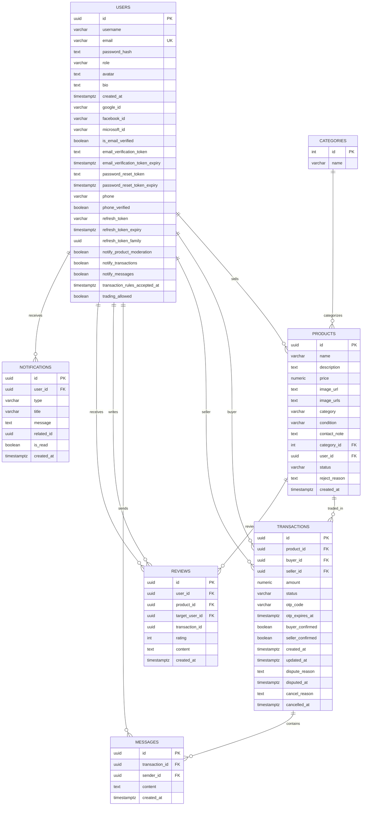

# Backend V1 ERD

Baseline migration: `backend/educycle-java/src/main/resources/db/migration/V1__baseline.sql`.

Scope follows ADR 0001 and ADR 0002: auth/user/profile, listing/category, transaction HTTP messages, review, admin-lite support, plus persisted notifications used by core flows.

Excluded from the V1 baseline: AI/RAG (`ai_knowledge_chunk`), book-wanted (`book_wanted_*`), wishlist (`wishlist_items`), media-only proxy data, and WebSocket-only persistence.

## Notes

- `TransactionStatus`: `PENDING`, `ACCEPTED`, `MEETING`, `COMPLETED`, `AUTO_COMPLETED`, `REJECTED`, `CANCELLED`, `DISPUTED`.
- `ProductStatus`: `PENDING`, `APPROVED`, `REJECTED`, `SOLD`.
- `Role`: `USER`, `ADMIN`.
- `reviews.transaction_id` is an external reference for business rules, not an enforced FK, matching the current JPA model.
- `notifications` stays in the baseline because product and transaction core services persist notification side effects. The notification REST API is not part of the V1 public contract.
