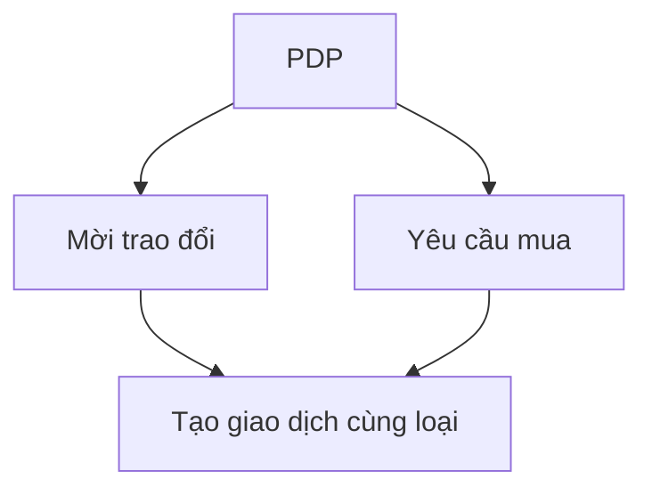

# EduCycle — Đặc tả thiết kế lại UI (theo Figma + yêu cầu sản phẩm)

**Figma (nguồn mẫu):** [Untitled — uxeqZgXeo6h7k5Vps2gEfo](https://www.figma.com/design/uxeqZgXeo6h7k5Vps2gEfo/Untitled?m=auto&t=DWLpC5xy7QADQIu6-6)

> **Lưu ý kỹ thuật:** Khi triển khai trong repo này, **chỉ dùng biến từ** `[frontend/src/styles/tokens.css](../../frontend/src/styles/tokens.css)` (hoặc mở rộng file đó bằng primitive/semantic mới). **Không** hardcode hex/pixel spacing ngoài token.

---

## Tham chiếu ảnh thiết kế

**Mục đích:** Một **ảnh toàn cục** (screenshot/export từ Figma hoặc PNG do designer lưu) làm **điểm tham chiếu thống nhất** cho team dev và review — bổ sung cho link Figma khi không mở được file hoặc cần so nhanh trên PR.

**Cách dùng (đồng thuận với designer):**

- Ảnh mang tính **hướng dẫn bố cục / mood / hierarchy**, **không** yêu cầu clone 1:1 từng pixel nếu trái với luồng code hoặc token hiện có.
- Khi cập nhật mẫu, **thay file** cùng tên hoặc thêm phiên bản có hậu tố ngày (ví dụ `educycle-ui-full-2026-03-28.png`) và sửa bảng dưới.

**Vị trí file trong repo (đặt ảnh tại đây):**


| File                                                               | Mô tả ngắn                                                                                                                       |
| ------------------------------------------------------------------ | -------------------------------------------------------------------------------------------------------------------------------- |
| `[reference/educycle-ui-full.png](reference/educycle-ui-full.png)` | Ảnh **toàn màn** (hoặc tổng hợp các frame chính ghép dọc) — *thêm file khi có; nếu chưa có thì folder `reference/` vẫn giữ chỗ.* |
| `[reference/README.md](reference/README.md)`                       | Hướng dẫn ngắn + ngày export + tên người cập nhật (tuỳ chọn).                                                                    |


**Figma gốc (bản editable):** cùng file như đầu tài liệu — [Untitled — uxeqZgXeo6h7k5Vps2gEfo](https://www.figma.com/design/uxeqZgXeo6h7k5Vps2gEfo/Untitled?m=auto&t=DWLpC5xy7QADQIu6-6).

---

## 0. Tổng quan sản phẩm

**EduCycle** là nền tảng **trao đổi đồ dùng học tập, sách và tài liệu** giữa sinh viên (P2P, có trạng thái giao dịch, OTP khi gặp mặt, chat).

**Phạm vi nội dung (policy UI + dữ liệu):**

- **Ưu tiên hiển thị:** sách, giáo trình, tài liệu in/PDF, đồ dùng học tập (bút, máy tính bỏ túi học tập, vở… nếu có trong danh mục cho phép).
- **Không làm nổi bật / hạn chế:** điện tử tiêu dùng, phụ kiện không gắn học tập (tai nghe gaming, v.v.).  
  - **UI:** không dùng hero/category mặc định cho “Công nghệ / Điện tử”; copy và ảnh minh họa chỉ học thuật.  
  - **Dữ liệu:** lọc danh mục phía client + (khuyến nghị) rule phía server nếu cần.

---

## 1. Mapping trang Figma → route / file hiện tại (EduCycle)


| Màn hình thiết kế              | Route đề xuất (React Router)         | File/page hiện có (tham chiếu)                      |
| ------------------------------ | ------------------------------------ | --------------------------------------------------- |
| Home                           | `/`                                  | `HomePage.jsx`                                      |
| Tìm kiếm / kết quả             | `/products` hoặc `/search`           | `ProductListingPage.jsx` (mở rộng filter)           |
| Chi tiết mặt hàng              | `/products/:id`                      | `ProductDetailPage.jsx`                             |
| Hồ sơ người dùng (public)      | `/users/:id`                         | `UserPublicProfilePage.jsx`                         |
| Hồ sơ / cài đặt (đã đăng nhập) | `/profile`                           | `ProfilePage.jsx`                                   |
| Hoạt động giao dịch            | `/transactions`, `/transactions/:id` | `TransactionsPage.jsx`, `TransactionDetailPage.jsx` |
| Hướng dẫn / nội quy            | `/transactions/guide`                | `TransactionGuidePage.jsx`                          |


**Nút hành động trên PDP (chi tiết):**  

- Map **“Mời trao đổi”** → luồng tạo **transaction** / chat (đã có API + WS).  
- Map **“Yêu cầu mua”** → cùng luồng **đề nghị giao dịch** (ngôn ngữ có thể là “Xin mua / Đề nghị trao đổi” cho đúng P2P).

---

## 2. Design tokens — bảng màu “soft / ấm / học đường”

Yêu cầu: đỏ/đỏ đậm dịu, xanh lam, nâu nhạt — **không neon**.

**Cách làm trong repo:** thêm **primitive** (ví dụ `--brick-`*, `--paper-`*, `--ink-*`) trong `tokens.css`, rồi **gán lại semantic** (`--primary-`*, `--bg-`*, `--text-*`) để toàn app đổi màu một lần.

**Gợi ý giá trị (có thể tinh chỉnh theo Figma khi export variable):**


| Vai trò                      | Token semantic đề xuất               | Gợi ý primitive (ví dụ)                    |
| ---------------------------- | ------------------------------------ | ------------------------------------------ |
| Primary (CTA, link)          | `--primary-500` …                    | Xanh lam đậm dịu `#2f5f9e` → map vào scale |
| Primary hover                | `--primary-600`                      | Tối hơn ~8%                                |
| Accent ấm (badge, highlight) | `--accent-500` hoặc `--warm-500` mới | Đỏ gạch nhạt `#c45c4a`                     |
| Nền trang                    | `--bg-primary`, `--bg-canvas`        | Nâu giấy rất nhạt `#f7f4ef`                |
| Nền thẻ                      | `--bg-elevated`                      | Trắng `#ffffff`                            |
| Viền                         | `--border-light`                     | `#e8e0d6`                                  |
| Chữ chính                    | `--text-primary`                     | `#1e2a33`                                  |
| Chữ phụ                      | `--text-secondary`                   | `#5c6670`                                  |


**Typography:**

- **Font:** [Open Sans](https://fonts.google.com/specimen/Open+Sans) hoặc [Roboto](https://fonts.google.com/specimen/Roboto) — load qua `@font-face` hoặc Google Fonts một lần trong `index.html` / CSS entry.
- **Token đề xuất** (thêm vào `tokens.css` nếu chưa có đủ):

```css
:root {
  --font-sans: 'Open Sans', system-ui, sans-serif;
  --text-xs: var(--space-2);   /* hoặc giữ scale hiện có trong tokens */
  --text-sm: …;
  --text-base: …;
  --text-lg: …;
  --text-xl: …;
  --text-2xl: …;
  --weight-regular: 400;
  --weight-medium: 600;
  --weight-bold: 700;
}
```

**Áp dụng:** `body { font-family: var(--font-sans); }` (trong `index.css` hoặc layout gốc).

---

## 3. Breakpoint & layout


| Tên     | Min width          | Hành vi                                               |
| ------- | ------------------ | ----------------------------------------------------- |
| Desktop | ≥ `1200px`         | Sidebar filter cố định trái (search); grid 4 cột card |
| Tablet  | `768px` – `1199px` | Filter collapsible (drawer); grid 2–3 cột             |
| Mobile  | `480px` – `767px`  | 1 cột; filter full-screen sheet                       |
| Small   | < `480px`          | Cùng mobile; tăng padding nút tối thiểu chạm          |


**Trong CSS:** dùng `var(--space-*)` cho padding/margin; media query chỉ số `px` cho breakpoint là **chấp nhận được** (breakpoint không có token trong nhiều dự án), hoặc định nghĩa `--bp-tablet: 768px` trong tokens nếu muốn thống nhất.

---

## 4. Wireframe / bố cục từng trang (room by room)

### 4.1 Trang chủ (Home)

**Mục tiêu:** hero rõ value proposition, ô tìm kiếm, danh mục thường dùng, tính năng nổi bật, lời khuyên sinh viên.

**Cấu trúc khối (trên → dưới):**

1. **Header** — logo, nav (Tìm kiếm, Đăng tin, Giao dịch, Hồ sơ), CTA “Đăng tin”.
2. **Hero** — headline + subcopy; **search bar** lớn (placeholder: “Tìm giáo trình, môn học, ISBN…”); nút “Tìm”.
3. **Quick categories** — chip/ card ngang cuộn: “Toán”, “Vật lý”, “Tiếng Anh”, “Luật”, “Y khoa”… (map `categoriesApi`).
4. **Featured listings** — carousel hoặc grid `ProductCard` (ảnh, tên, giá/“Liên hệ”, rating).
5. **Value props** — 3 cột: “An toàn OTP”, “Chat trong giao dịch”, “Uy tín người bán”.
6. **Tips for students** — card nền `--bg-muted`: checklist ngắn (gặp mặt nơi công cộng, kiểm tra tình trạng sách…).
7. **Footer** — link Điều khoản, Hướng dẫn giao dịch.

**Wireframe ASCII:**

```
+-- Header ------------------------------------------+
| [Logo]  Tìm kiếm  Giao dịch     [Đăng nhập][Đăng tin] |
+-----------------------------------------------------+
| [=========== Hero: headline =====================] |
| [ Search................................... ] [Tìm] |
| [chip][chip][chip][chip]...                         |
+-----------------------------------------------------+
| Tin nổi bật          [card][card][card][card]      |
| Lợi ích              | A | B | C |                  |
| Mẹo sinh viên        [tip card full width]          |
+-- Footer --------------------------------------------+
```

---

### 4.2 Tìm kiếm / Results

**Thành phần:**

- **Thanh trên:** ô query + sort (Mới nhất, Giá, Đánh giá).
- **Cột trái (desktop):** **bộ lọc**  
  - Trường / khoa (nếu có field hoặc tag — nếu BE chưa có, dùng **category** + **keyword** trước).  
  - Chuyên ngành → map **category**.  
  - Thời gian: “Đăng trong 7 ngày / 30 ngày” (filter `createdAt` nếu API hỗ trợ; không có thì client hoặc backlog BE).  
  - Tình trạng: map `condition` (Mới / Tốt / …).  
  - Đánh giá: sao tối thiểu (cần API `minRating` hoặc lọc client sau khi có `avgRating` trên listing).
- **Vùng chính:** lưới `ProductCard` + phân trang (đã có server-side page/size).

**Empty state:** “Không có tài liệu phù hợp” + gợi ý bỏ bớt lọc.

---

### 4.3 Chi tiết mặt hàng (PDP)

**Khối:**

1. Gallery ảnh (trái) + thumbnails.
2. Cột phải: tên, **loại tài liệu** (category), **tình trạng**, giá / liên hệ, người bán (link `/users/:id`), rating tóm tắt.
3. Tabs hoặc stack: **Mô tả** | **Thông tin thêm** (tác giả, môn, ISBN nếu có field).
4. **Reviews** — danh sách đánh giá + form (nếu đủ điều kiện).
5. **Sticky actions (mobile):**
  - Primary: **“Mời trao đổi”** / **“Yêu cầu mua”**  
  - Secondary: **“Lưu yêu thích”** (wishlist).

**Ý nghĩa nút:**


| Nút                 | Hành vi kỹ thuật                                                  | Ý nghĩa UX                            |
| ------------------- | ----------------------------------------------------------------- | ------------------------------------- |
| Mời trao đổi        | Mở modal xác nhận → `POST /api/transactions` (hoặc flow hiện tại) | Bắt đầu P2P không thanh toán online   |
| Yêu cầu mua         | Cùng endpoint / copy khác                                         | Nhấn mạnh mua nhưng vẫn gặp mặt + OTP |
| Lưu yêu thích       | `wishlistApi`                                                     | Theo dõi tin không cam kết            |
| Xem hồ sơ người bán | `navigate(/users/:id)`                                            | Tin cậy                               |


---

### 4.4 Hồ sơ người dùng

**Public (`/users/:id`):**

- Header: avatar, **bút danh** (`username`), badge xác minh email/SĐT (nếu public).
- Tabs: **Đang chia sẻ** | **Đã hoàn thành** (products + transactions tùy API).
- **Điểm uy tín** — từ reviews/trades (hiển thị số liệu đang có).
- **Đánh giá** — list review về user.

**Private (`/profile`):** giữ mục bảo mật, thông báo (đã có); bổ sung **“Tài liệu của tôi”** link tới Dashboard.

---

### 4.5 Hoạt động giao dịch

**Danh sách:** card theo trạng thái (PENDING, ACCEPTED, …) — màu semantic từ `STATUS_CONFIG`.

**Chi tiết:**

- Timeline trạng thái.
- **Chat** (STOMP) + vùng cố định **Nội quy** (collapsible): link `TransactionGuidePage`.
- OTP: chỉ hiện đúng vai (buyer generate / seller verify) theo logic hiện tại.

---

## 5. Component library (danh sách + class gợi ý)

**Prefix gợi ý:** `edu-` (đồng bộ với `edu-page`, `edu-container` đã có).


| Component                  | Mô tả                          | Class / file gợi ý                         |
| -------------------------- | ------------------------------ | ------------------------------------------ |
| `EduButton`                | Primary / secondary / ghost    | `.edu-btn`, `.edu-btn--primary`            |
| `EduInput`, `EduSearchBar` | Input + icon                   | `.edu-input`, `.edu-search`                |
| `EduChip`                  | Danh mục / filter tag          | `.edu-chip`, `.edu-chip--active`           |
| `EduCard`                  | Surface nền trắng + shadow nhẹ | `.edu-card`                                |
| `ProductCard`              | Ảnh, title, meta, price        | refactor từ grid hiện tại                  |
| `FilterPanel`              | Sidebar filters                | `.edu-filters`, `.edu-filters__section`    |
| `RatingStars`              | Hiển thị + aria                | `.edu-rating`, `aria-label="X trên 5 sao"` |
| `EmptyState`               | Icon + CTA                     | `.edu-empty`                               |
| `SectionHeader`            | Title + subtitle + action      | `.edu-section-head`                        |


**Snippet CSS mẫu (semantic):**

```css
.edu-card {
  background: var(--bg-elevated);
  border: 1px solid var(--border-light);
  border-radius: var(--radius-lg);
  box-shadow: var(--shadow-sm);
  padding: var(--space-4);
}

.edu-btn--primary {
  background: var(--primary-600);
  color: var(--neutral-0);
  border-radius: var(--radius-md);
  padding: var(--space-2) var(--space-4);
  min-height: var(--space-10); /* touch target */
}

.edu-btn--primary:focus-visible {
  outline: 2px solid var(--primary-400);
  outline-offset: 2px;
}
```

---

## 6. Iconography

**Bộ:** Phosphor (đã dùng trong project) hoặc Lucide — **outline**, kích thước `1.25rem`–`1.5rem`.


| Icon            | Ý nghĩa               |
| --------------- | --------------------- |
| BookOpen        | Tài liệu / sách       |
| Chats           | Trao đổi / chat       |
| Handshake       | Giao dịch P2P         |
| Star            | Đánh giá              |
| MagnifyingGlass | Tìm kiếm              |
| Funnel          | Bộ lọc                |
| ShieldCheck     | An toàn / OTP         |
| GraduationCap   | Sinh viên / học thuật |


---

## 7. Trường dữ liệu (BE / FE) — gợi ý mở rộng

**Đã có (tùy API hiện tại):** `name`, `description`, `category`, `condition`, `price`, `imageUrls`, seller, `createdAt`.

**Đề xuất bổ sung (backlog Flyway + DTO nếu cần):**


| Field                           | Ví dụ                  | Ghi chú                                 |
| ------------------------------- | ---------------------- | --------------------------------------- |
| `displayName` / dùng `username` | Bút danh               | Đã có user profile                      |
| `school`                        | “ĐH Bách Khoa”         | Optional profile                        |
| `subject` / `courseCode`        | “Vi tích phân A”       | Lọc tìm kiếm                            |
| `author`                        | Tác giả sách           | PDP                                     |
| `updatedAt`                     | Thời gian cập nhật tin | Sort / hiển thị “Cập nhật 2 ngày trước” |


---

## 8. UX flow (Mermaid)

### 8.1 Từ tìm kiếm đến giao dịch

```mermaid
flowchart LR
  A[Home: nhập tìm kiếm] --> B[Trang kết quả + lọc]
  B --> C[PDP]
  C --> D{Đã đăng nhập?}
  D -- Không --> E[/auth]
  D -- Có --> F[Modal / trang xác nhận]
  F --> G[Tạo transaction PENDING]
  G --> H[Chat + timeline trạng thái]
  H --> I[Gặp mặt + OTP]
  I --> J[COMPLETED]
```


### 8.2 PDP — hai CTA




---

## 9. Accessibility (checklist dev)

- Contrast chữ/nền: tối thiểu **4.5:1** cho body (kiểm tra sau khi đổi token).
- Mọi `button` có **nhãn** hoặc `aria-label` (icon-only).
- `input` gắn `label` `htmlFor` hoặc `aria-labelledby`.
- Focus ring: `:focus-visible` rõ trên nút và link.
- `alt` mô tả ngắn cho ảnh sách; decorative → `alt=""`.
- Trạng thái giao dịch: không chỉ màu — có **icon + text**.

---

## 10. Kiến nghị công nghệ (trong phạm vi repo)


| Lựa chọn         | Khuyến nghị cho EduCycle    |
| ---------------- | --------------------------- |
| **React + Vite** | **Giữ** — đã là stack chính |
| Vue / Svelte     | Không cần đổi               |
| HTML tĩnh        | Chỉ prototype               |


**Thư viện UI:** có thể giữ **CSS module / file CSS theo page** + component chia nhỏ; không bắt buộc shadcn nếu muốn giữ bundle nhẹ.

---

## 11. Xuất PDF / PNG (bàn giao thiết kế)

**Từ Figma:**

1. Mở file [link trên](#educycle--đặc-tả-thiết-kế-lại-ui-theo-figma--yêu-cầu-sản-phẩm).
2. Chọn frame từng màn: Home, Search, PDP, Profile, Transaction.
3. **Export:** PNG @2x hoặc PDF (File → Export / Export frames).
4. Lưu vào repo (tuỳ team): ví dụ `docs/design/exports/` (không commit file nặng nếu policy git không cho — có thể dùng link Figma + Dev Mode).

**Sau khi code xong:** có thể chụp **Playwright screenshot** các URL production để làm “as-built” trong wiki.

---

## 12. Thứ tự triển khai (cho dev)

1. **tokens.css** — thêm primitive ấm + remap semantic; font Open Sans/Roboto.
2. **Layout shell** — header/footer dùng chung (nếu chưa có component).
3. **HomePage** — hero + search + categories + section copy.
4. **ProductListingPage** — `FilterPanel` + grid card.
5. **ProductDetailPage** — gallery, CTA, reviews layout.
6. **UserPublicProfilePage** — tabs + reviews.
7. **Transaction pages** — timeline + chat + nội quy panel.
8. **QA** — responsive 1200 / 768 / 480, keyboard, contrast.

---

## 13. Liên kết nhanh

- Figma: `https://www.figma.com/design/uxeqZgXeo6h7k5Vps2gEfo/Untitled`
- Design system code: `frontend/src/styles/tokens.css`
- Design rules nội bộ: `docs/design/educycle/MASTER.md`

